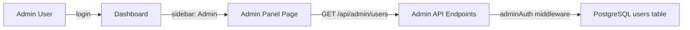

# Super Admin User Management

## Overview

Add a `role` column to the `users` table. Admin users see an extra "Admin" link in the dashboard sidebar that opens a user management panel. A CLI script (`create-admin.js`) promotes any existing user to superadmin.

## Architecture



## Changes

### 1. Database: Add `role` column to `users` table

File: [database.js](database.js)

- Add `role VARCHAR(20) DEFAULT 'user'` to the `CREATE TABLE users` statement
- After the CREATE TABLE, add: `ALTER TABLE users ADD COLUMN IF NOT EXISTS role VARCHAR(20) DEFAULT 'user';` (so existing databases get the column without dropping the table)

### 2. Backend: Include `role` in auth functions

File: [server.js](server.js)

- Update `signToken()` to include `role` in the JWT payload:
  ```js
  jwt.sign({ id: user.id, email: user.email, name: user.name, role: user.role || 'user' }, ...)
  ```
- Update `safeUser()` to keep the `role` field (it already copies all fields, so this should work automatically)

### 3. Backend: Add `adminAuth` middleware

File: [server.js](server.js)

- Add a new middleware after the existing `auth` middleware:
  ```js
  function adminAuth(req, res, next) {
    if (!req.user || req.user.role !== 'superadmin') {
      return res.status(403).json({ error: 'Admin access required' });
    }
    next();
  }
  ```
- This is used as `auth, adminAuth` on admin-only routes

### 4. Backend: Add admin API endpoints

File: [server.js](server.js)

Add these endpoints (all protected with `auth, adminAuth`):

| Method | Endpoint | Action |
|--------|----------|--------|
| GET | `/api/admin/users` | List all users (with search/pagination) |
| GET | `/api/admin/users/:id` | Get single user details + their invoice/party counts |
| PUT | `/api/admin/users/:id` | Edit user (name, email, phone, role, business_name, etc.) |
| DELETE | `/api/admin/users/:id` | Delete user and all their data (cascades via FK) |

The GET list endpoint should support `?q=` search (by name/email/phone) and return users sorted by `created_at DESC`, excluding `password_hash`.

### 5. Frontend: Add admin sidebar link (conditional)

File: [public/dashboard.html](public/dashboard.html)

- Add an admin nav item before the settings button (hidden by default):
  ```html
  <button type="button" class="nav-item" data-page="admin" id="adminNavItem" onclick="window.goTo('admin')" style="display:none">
    <!-- shield icon --> Admin Panel
  </button>
  ```

File: [public/dashboard.js](public/dashboard.js)

- On page load (where user data is fetched from `/api/auth/me`), check if `user.role === 'superadmin'` and show the admin nav item:
  ```js
  if (currentUser.role === 'superadmin') {
    document.getElementById('adminNavItem').style.display = '';
  }
  ```

### 6. Frontend: Add `renderAdmin()` page

File: [public/dashboard.js](public/dashboard.js)

- Add `case 'admin': renderAdmin(); break;` to the `window.goTo` switch
- Create `renderAdmin()` function that:
  - Fetches `GET /api/admin/users`
  - Renders a table with columns: Name, Email, Phone, Business, Role, Registered, Actions (Edit/Delete)
  - Search box at top to filter users by name/email
  - Edit button opens an inline edit form or modal to modify user fields
  - Delete button with confirmation prompt
  - Shows total user count

### 7. Frontend: Add admin styles

File: [public/dashboard.css](public/dashboard.css)

- Add styles for the admin user table, action buttons, edit modal, and search bar

### 8. CLI script: `create-admin.js`

New file: [create-admin.js](create-admin.js)

- Run on EC2 with: `node create-admin.js user@email.com`
- Connects to PostgreSQL using `DATABASE_URL` from `.env`
- Finds the user by email and sets `role = 'superadmin'`
- Prints success/failure message and exits

### 9. Update `deploy.sh`

No changes needed -- the existing deploy script will pick up all changes automatically since it does `git pull` and `pm2 restart`.

## Implementation Order

1. `database.js` -- add role column
2. `server.js` -- signToken, adminAuth middleware, admin API endpoints
3. `create-admin.js` -- CLI script
4. `dashboard.html` -- admin nav item
5. `dashboard.js` -- renderAdmin page + conditional sidebar visibility
6. `dashboard.css` -- admin panel styles

## Todos

- id: add-role-column
  content: "Add role column to users table in database.js"
  status: pending

- id: backend-admin-auth
  content: "Update signToken, add adminAuth middleware, add admin API endpoints in server.js"
  status: pending

- id: create-admin-script
  content: "Create create-admin.js CLI script to promote a user to superadmin"
  status: pending

- id: frontend-admin-panel
  content: "Add admin sidebar link, renderAdmin page, and styles in dashboard files"
  status: pending

- id: deploy-admin
  content: "Deploy to EC2 and create the first superadmin user"
  status: pending
